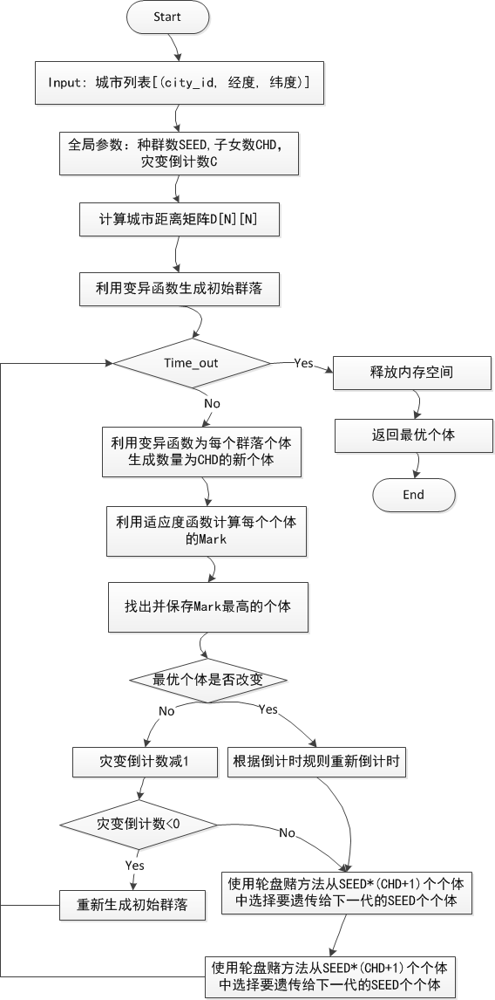


## 问题描述
给定地图上的若干地点及对应经纬度，找出一条将所有点串联起来的最短路径，即TSP问题。TSP问题的搜索空间是n个点的所有排列，解空间为n!。本文利用[遗传算法](https://zh.wikipedia.org/wiki/%E9%81%97%E4%BC%A0%E7%AE%97%E6%B3%95)的思想解决TSP问题。

## 遗传算法描述
#### 种群与个体
* 种群：种群代表基因序列的多样性。种群越大，多样性越丰富，越快找到最优染色体，但运算量也会加大
* 染色体：即基因序列，这里表示特定的路径编号序列。一个编号序列代表一个个体。
#### 变异函数
* 交叉算子：通常指两个染色体交叉变换，这里表示转移变异，将染色体中一个随机片段与另一个随机片段置换。
    * 例如： AB`CD`EF`GH`  =>  AB`GH`EF`CD`
* 变异算子：通常指改变个体编码串中的某些基因值，这里表示将某个片段逆序。
    * 例如： AB`CDEF`GH  =>  AB`FEDC`GH
#### 适应度函数
* 评价一个个体好坏的指标，适应度函数值越大，解的质量越好。
    * 适应度指标：
```math
E = \frac{1.0}{\sum_{i=0}^{n-1} (D[i][i+1]) + D[n-1][0]}
```
其中`D[i][i+1]`表示地点`i`到地点`j`的距离
* 距离计算公式：
    * 南北方向`AM` = 地球半径 \* 纬度差 \* Math.PI/180.0；
    * 东西方向`BM` = 地球半径 \* 经度差 \* Cos<当地纬度数 \* Math.PI/180.0>
    * `距离 = sqrt(AM \* AM + BM \* BM)`
#### 选择算子
* 选择算子：用于对个体进行优胜劣汰的操作，筛选出部分适应度高的个体遗传到下一代。
* **轮盘赌**：又称比例选择算子，各个个体被选中的概率与其适应度函数值大小成正比。轮盘赌是常用的选择算法

#### 灾变
* **引入**：遗传算法通过变异实现空间搜索，适应度函数对遗传算法收敛性影响很大，但遗传算法仍然有可能陷入局部最优。当最优个体在连续多代遗传时都保持不变时，可以认为陷入局部最优，这是可以通过灾变跳出局部最优。
* **概念**：灾变即物种灭绝，新物种的诞生。这里表示所有种群染色体重新初始化。
* **灾变倒计时**：举例说明：假设灾变初始值为500，灾变倍增数为2.5，从灾变初始值500开始，每一代递减一次，如果出现了新的最优值，就从新开始计数
    1. 如果出现新最优值的时候倒计数递减次数的2.5倍已经超过500，则从超过500的新初始值开始倒数。
    2.若未超过500，则把500作为初始值开始倒数。
#### 其他优化
* 四边形优化
    * 若染色体序列中相邻4个点组成的多边形不是凸四边形时，转换为凸四边形。


## 算法流程图



