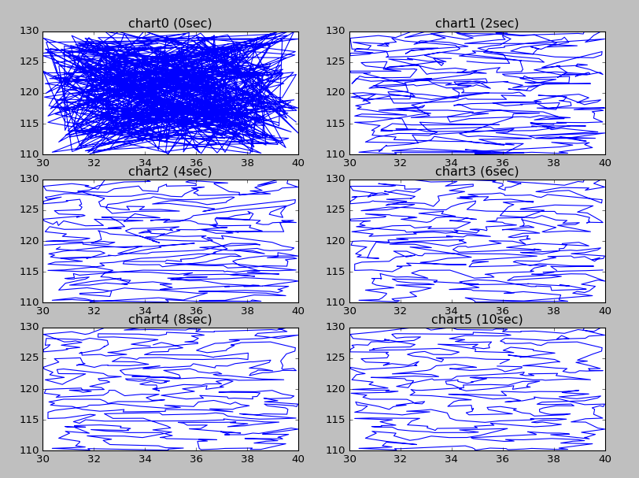

## 基于遗传算法的旅行商最短路径规划问题 (GA-based TSP)

### 算法描述
[算法描述](Description.md)

### Install 
    swig -c++ -python traveller.i
    python setup.py install

### Some Test:
> Python Test: 

    cd test
    python test.py
    
    
> C++ Test:

    gcc -std=c++11 -fPIC -lm -lstdc++ -pthread DPoint.cpp CityMap.cpp test.cpp -o test -g
    ./test city_num time_out

> Execute

* 设置城市数500，将随机生成 经度~(30.0, 40.0)，纬度~(110.0, 130.0)之间的城市
    * 城市距离没有使用球面模型计算，而是如下简化的计算方法：
        * 南北方向AM = 地球半径 \* 纬度差 \* Math.PI/180.0；
        * 东西方向BM = 地球半径 \* 经度差 \* Cos<当地纬度数 \* Math.PI/180.0>
        * 距离 = sqrt(AM\*AM + BM\*BM)
    * reference: http://tech.meituan.com/lucene-distance.html
* 遗传算法参数:
    * 种群数：种群数越大，遗传基因多样性越丰富
    * 子女数：每个种群遗传产生下一代的子女数
    * 最大转移数：变异时两个基因产生交叉的序列长度，该数值越大，变异性越大
    * ***灾变***：灾变初始值，灾变倍增值
        * 灾变的概念：这里设定当最优个体在连续多代遗传时都保持不变，就启动灾变倒计时。
        当倒计时为0时表示当前种群陷入***局部最优***，将种群基因重置，类似于物种灭绝并产生新物种
* 设置程序运行时间20秒，设置调试模式为true
* Result of Execution：

        [work@localhost test]$ python analysis.py 
        time_out: 2000 , state:  500个城市 第2776代 最优产生于第2763代 分数0.186737 里程34096140.417267 灾变倒计数0788 灾变计数000 群体平均分0.143186 用时2000(ms)
        time_out: 4000 , state:  500个城市 第5695代 最优产生于第5682代 分数0.237647 里程26791815.559546 灾变倒计数0788 灾变计数000 群体平均分0.173504 用时4000(ms)
        time_out: 6000 , state:  500个城市 第8691代 最优产生于第8618代 分数0.258155 里程24663463.804994 灾变倒计数0728 灾变计数000 群体平均分0.196991 用时6010(ms)
        time_out: 8000 , state:  500个城市 第11644代 最优产生于第11640代 分数0.280567 里程22693316.459644 灾变倒计数0797 灾变计数000 群体平均分0.216620 用时8010(ms)
        time_out: 10000 , state:  500个城市 第14671代 最优产生于第14565代 分数0.291937 里程21809472.816275 灾变倒计数0695 灾变计数000 群体平均分0.188085 用时10010(ms)

### Q&A:
* ERROR：traveller_wrap.cxx:2843:13: 错误：‘ptrdiff_t’不是一个类型名
                virtual ptrdiff_t distance(const SwigPyIterator &/*x*/) const\
    * Solution：类型ptrdiff_t在<stddef.h>中定义，在swig生成的traveller_wrap.cxx文件头部添加：#include<stddef.h>

